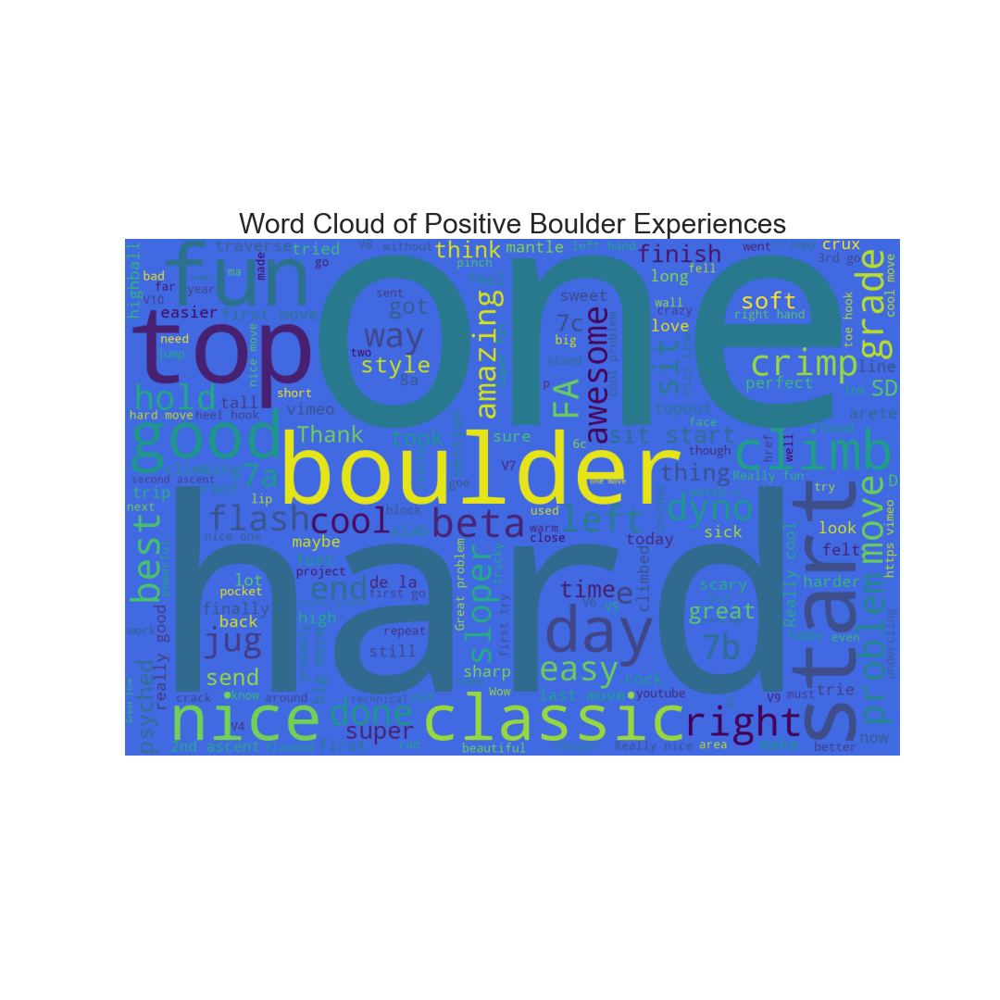

# Made public version of repo

## please see individual folders of project to see most up to date code 

## 1) convert sqlite database --> csv files --> postgres database locally using pgAdmin4
    - * upload postgres sql backup to aws postgres rds instance to host information (big data)
## 2) create django app with +4million entries and +60,000 users, +25 features per entry
    - * host app and analytics on aws elastic beanstalk EC2 instance
    - * password functionality recovery
    - * login & registration authentication functionalty
    - * update and revise information functionality (forms functionalty)
    - * analytics on climbers
    - * search app function created to search postgres specific columns for matches
    - * class based coding for page rendering
    - * bootstrap styling & html
    - * virtual environments used for development and deployment

## 3) code not uploaded for security/production reasons. but visit http://www.wikiclimber.com to see website.

## 4) Things still to do:
    - * create secure https certificate through aws/dns for security reasons
    - * incorporate climbing recommendation system with Machine learing algos w/ collaborative/content/hybrid 
    - * add training content and static files for image links
    - * add chat app between users

## Prediction Model Performance

Light GBM Classifer model has accuracy of 63.4% (0.6343692732918376)
- hyperparameters with Random Search CV with 5-fold cross-validation

    {'subsample_freq': 20, 'subsample': 0.7, 'reg_lambda': 1.3, 'reg_alpha': 1.2, 'num_leaves': 200, 'n_estimators': 400, 'min_split_gain': 0.3, 'max_depth': 20, 'colsample_bytree': 0.7}
### The confusion Matrix is 

 